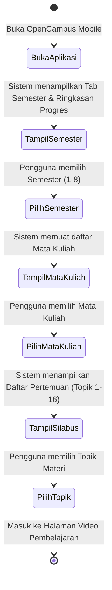
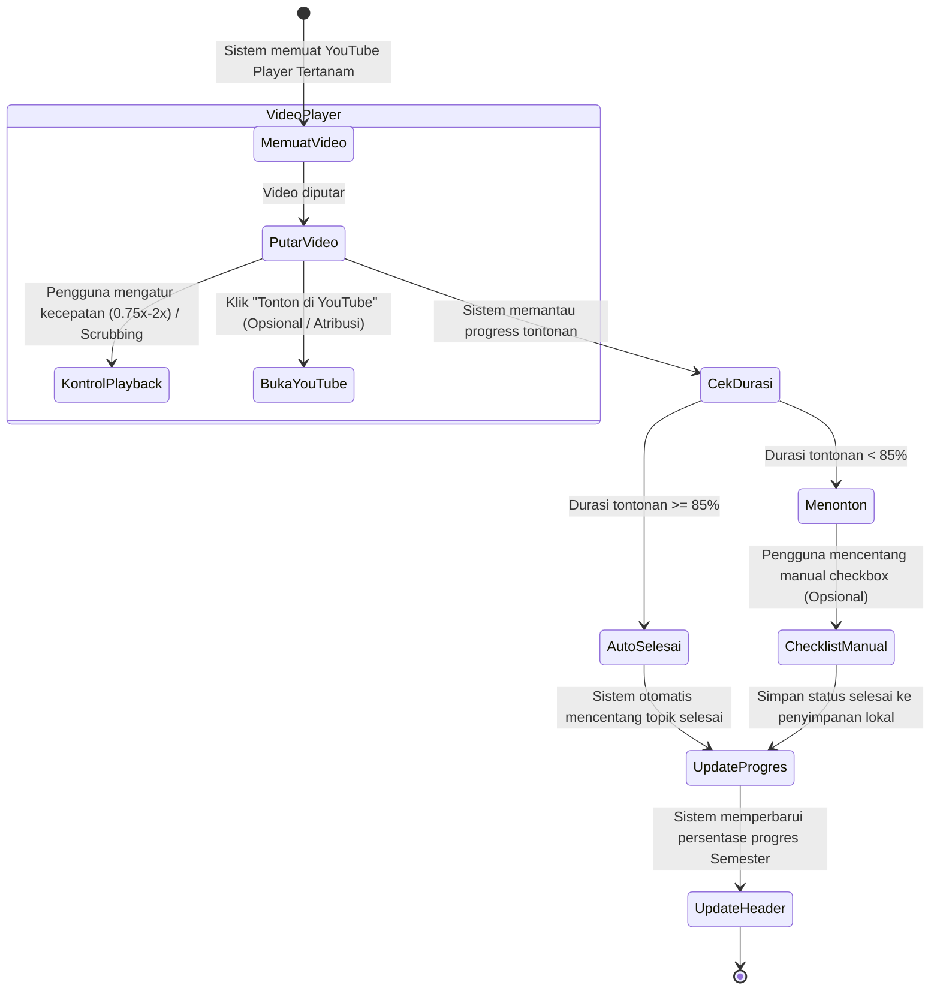
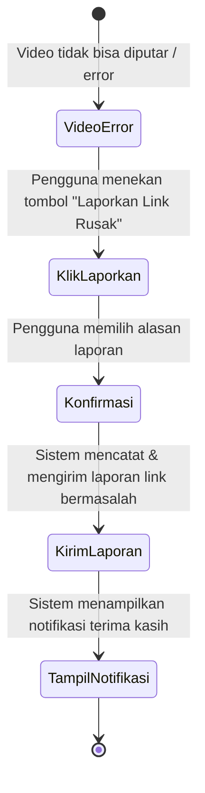

# Activity Diagram — OpenCampus Mobile (MVP v0.1)

Dokumen ini memetakan alur aktivitas (*Activity Diagram*) sederhana berdasarkan Use Case pada [USE_CASE.md](file:///Users/tommy-amarbank/Documents/oss-elearning/.docs/USE_CASE.md) dan [PRD.md](file:///Users/tommy-amarbank/Documents/oss-elearning/.docs/PRD.md).

---

## 1. Alur Utama: Navigasi Kurikulum & Memilih Materi (UC-01, UC-02, UC-03)

Diagram aktivitas saat pengguna membuka aplikasi, memilih semester, mata kuliah, hingga topik materi pembelajaran.

---

## 2. Alur Video Player & Pelacakan Progres (UC-04, UC-05, UC-07, UC-08, UC-09)

Diagram aktivitas pemutaran video tertanam, kontrol playback, serta penandaan progres belajar secara otomatis ($\ge 85\%$) maupun manual.

---

## 3. Alur Pelaporan Link / Video Rusak (UC-10)

Diagram aktivitas ketika video YouTube tidak dapat diputar (private / dihapus / error).

