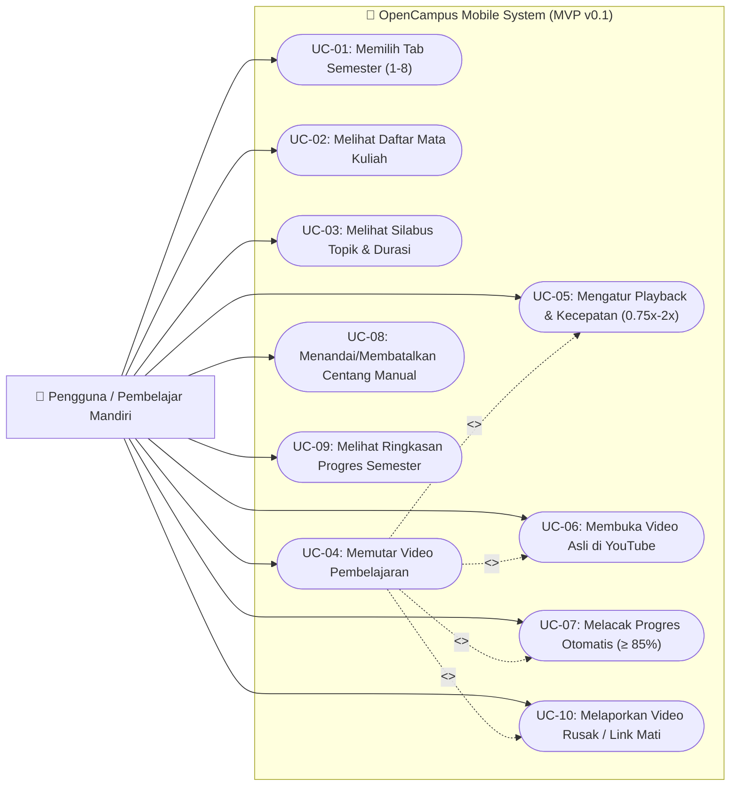

# Use Case Diagram — OpenCampus Mobile (MVP v0.1)

Dokumen ini memetakan diagram *Use Case* fungsional untuk **OpenCampus Mobile** berdasarkan spesifikasi pada [PRD.md](file:///Users/tommy-amarbank/Documents/oss-elearning/.docs/PRD.md).

---

## 1. Diagram Use Case (Mermaid)

---

## 2. Deskripsi Use Case

| Kode | Nama Use Case | Aktor | Deskripsi Singkat |
| :--- | :--- | :--- | :--- |
| **UC-01** | Memilih Tab Semester | Pengguna | Berpindah antar semester (Semester 1 s.d. 8). |
| **UC-02** | Melihat Daftar Mata Kuliah | Pengguna | Melihat daftar mata kuliah pada semester terpilih beserta estimasi pertemuan. |
| **UC-03** | Melihat Silabus Topik | Pengguna | Melihat daftar 16 pertemuan, judul materi, durasi video, dan nama channel kreator. |
| **UC-04** | Memutar Video Pembelajaran | Pengguna | Memutar video YouTube tertanam tanpa rekomendasi/komentar distraksi. |
| **UC-05** | Mengatur Playback | Pengguna | Mengontrol Play/Pause, scrubbing durasi, fullscreen, dan kecepatan putar (0.75x–2x). |
| **UC-06** | Membuka Video di YouTube | Pengguna | Menuju link video asli YouTube untuk atribusi kreator. |
| **UC-07** | Melacak Progres Otomatis | Pengguna / Sistem | Menandai materi selesai otomatis saat tontonan mencapai minimal 85%. |
| **UC-08** | Menandai Centang Manual | Pengguna | Mencentang atau membatalkan status selesai pada topik secara mandiri. |
| **UC-09** | Melihat Ringkasan Progres | Pengguna | Memantau persentase dan jumlah materi selesai di header semester. |
| **UC-10** | Melaporkan Link Rusak | Pengguna | Mengirim laporan ketika video YouTube berstatus private/dihapus/tidak dapat diputar. |
